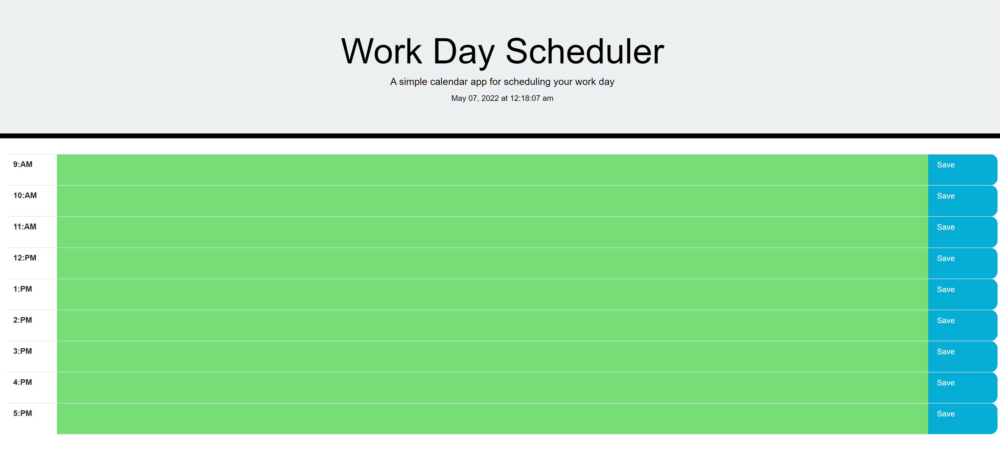

# 05 Third-Party APIs: Work Day Scheduler

# Simple calendar application that allows a user to save events for each hour of the day

##


After entering an event the information is gonna save as a localstorage and after refrsh the page event are persist.


## I reached the Acceptance Criteria

```
Quiz starting with clicking the start button
Timer start and user presenting with a question
after answering a question
user presenting with another question
WHEN user answering a question incorrectly
Time is subtracted from the clock
WHEN all questions are answered or the timer reaches 0
THEN the quiz is over
and user can see the result of the quiz
```

Planner table is working
The current day is display at the top of the calendar
Each hour presented with timeblock for standard business hour
Each timeblock is color coded to indicate whether it is in the past, present, or future
User can enter an event and save for that timeblock
The text for that event is saved in local storage
After refresh the saved events persist
```
